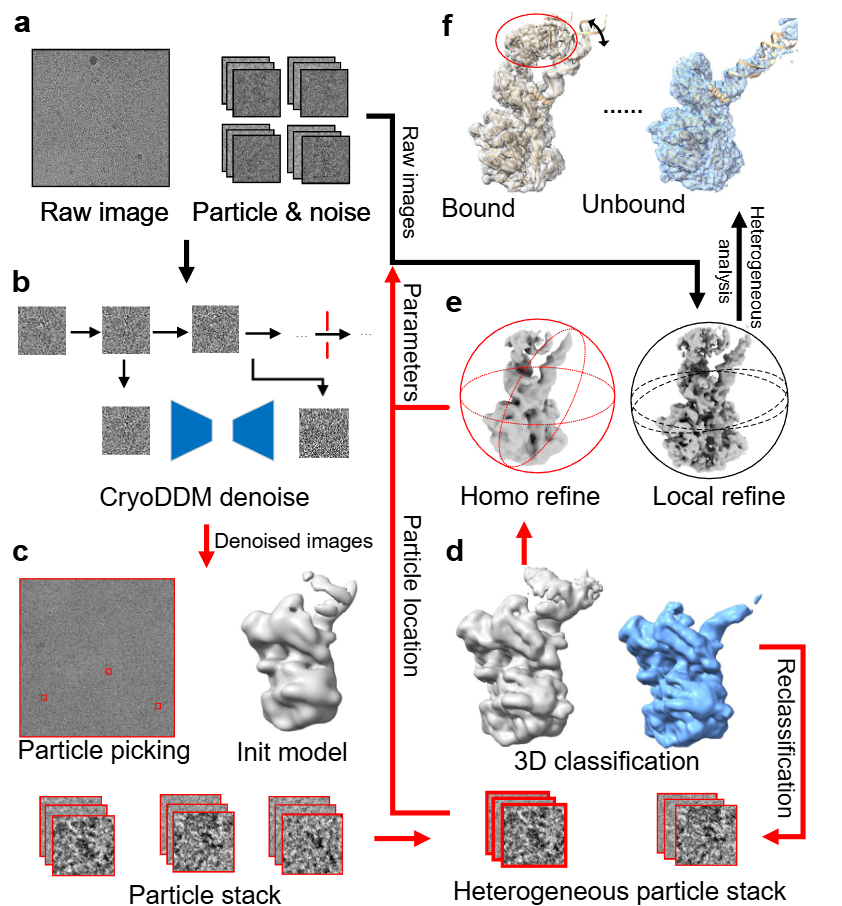

# Cryo-EM Diffusion Denoising

**中文** | [English](#english)

---

## 简介

基于扩散模型的冷冻电镜(Cryo-EM)图像去噪工具。该项目使用U-Net网络实现三步去噪流程，能够有效提升冷冻电镜图像的信噪比。

## 项目结构

```
source_code_beta1/
├── forward/                        # 前向扩散过程
│   ├── forward.py                  # 数据预处理主脚本
│   └── util_self.py                # 工具函数
├── backward/unet/                  # 反向去噪过程
│   ├── train_3step_compress.py     # 模型训练脚本
│   ├── predict.py                  # 推理脚本
│   ├── unet2d.py                   # U-Net模型定义
│   └── util_self.py                # 工具函数
└── util/                           # 其他工具
    ├── classification_benchmark/   # 分类基准测试
    └── cryo2star/                  # 格式转换工具
```

## 环境要求

- Python >= 3.8
- PyTorch >= 1.7
- CUDA (推荐用于GPU加速)

## 安装

```bash
pip install torch numpy mrcfile tqdm psutil torchvision
```

## 使用流程

### Step 1: 数据预处理（前向扩散）

从原始MRC图像和粒子坐标生成训练数据：

```bash
python forward/forward.py \
    --input_path <原始MRC图像目录> \
    --particles_coordinate <粒子坐标.star文件> \
    --particle_diamater <粒子直径(像素)> \
    --noise_path <噪声标签文件.txt> \
    --out_path <输出目录> \
    --beta 0.1288 \
    --total_steps 5 \
    --start 2
```

**参数说明：**

| 参数 | 缩写 | 默认值 | 说明 |
|------|------|--------|------|
| `--input_path` | `-ip` | - | 原始MRC图像目录路径 |
| `--particles_coordinate` | `-pc` | - | 粒子坐标文件(.star格式) |
| `--particle_diamater` | `-pd` | 200 | 粒子直径(像素) |
| `--noise_path` | `-np` | - | 噪声标签文件路径 |
| `--out_path` | `-op` | - | 输出目录路径 |
| `--beta` | - | 0.1288 | 扩散过程beta值 |
| `--total_steps` | - | 5 | 总扩散步数 |
| `--start` | - | 2 | 开始保存数据的步数 |

**输出结构：**
```
<out_path>/
├── s1/particles.mrcs    # 原始粒子
├── s2/input.mrcs        # 扩散输入
├── s2/label.mrcs        # 扩散标签
├── s3/noise.mrcs        # 噪声样本
├── val/input.mrcs       # 验证集输入
├── val/label.mrcs       # 验证集标签
└── log.txt              # 日志文件
```

### Step 2: 模型训练

使用预处理后的数据训练去噪模型：

```bash
python backward/unet/train_3step_compress.py \
    --input_path <预处理数据目录> \
    --out_path <模型保存目录> \
    --batch_size 64 \
    --gpus 0
```

**参数说明：**

| 参数 | 缩写 | 默认值 | 说明 |
|------|------|--------|------|
| `--input_path` | `-i` | - | 预处理数据目录(Step 1输出) |
| `--out_path` | `-o` | - | 模型保存目录 |
| `--batch_size` | `-b` | 64 | 批量大小 |
| `--gpus` | `-d` | 1 | 使用的GPU编号 |

**输出：**
- `<out_path>/<epoch>.pth` - 每个epoch的模型文件
- `<out_path>/checkpoint.pth` - 最新的checkpoint

### Step 3: 推理去噪

使用训练好的模型对新图像进行去噪：

```bash
python backward/unet/predict.py \
    --input_path <待去噪MRC图像目录> \
    --out_path <输出目录> \
    --model_path <模型文件.pth> \
    --particle_diamater <粒子直径> \
    --gpus 0 \
    --log_dir <日志目录>
```

**参数说明：**

| 参数 | 缩写 | 默认值 | 说明 |
|------|------|--------|------|
| `--input_path` | `-i` | - | 待去噪MRC图像目录 |
| `--out_path` | `-o` | - | 去噪结果输出目录 |
| `--model_path` | `-m` | - | 训练好的模型文件路径 |
| `--particle_diamater` | `-pd` | 200 | 粒子直径(像素) |
| `--gpus` | `-d` | 0 | 使用的GPU编号 |
| `--log_dir` | `-l` | - | 日志文件保存目录 |

## 输入输出格式

### 输入
- **MRC图像**: 归一化的标准MRC格式的冷冻电镜图像(`.mrc`)
- **粒子坐标**: CryoSPARC格式的坐标文件(`.star`)，每行包含：`文件名 x坐标 y坐标`
- **噪声标签**: 文本文件(`.txt`)，每行包含：`文件名 x坐标 y坐标`

### 输出
- **去噪图像**: MRC格式，归一化到[0,1]范围

## 完整示例

```bash
# Step 1: 数据预处理
python forward/forward.py \
    -ip /data/EMPIAR-10059/micrographs \
    -pc forward/10059/manualpick.star \
    -pd 200 \
    -np forward/10059/10059_.txt \
    -op /data/training_data/10059 \
    --beta 0.1288 \
    --total_steps 5 \
    --start 2

# Step 2: 模型训练
python backward/unet/train_3step_compress.py \
    -i /data/training_data/10059 \
    -o /data/models/10059 \
    -b 64 \
    -d 0

# Step 3: 推理
python backward/unet/predict.py \
    -i /data/EMPIAR-10059/micrographs \
    -o /data/denoised/10059 \
    -m /data/models/10059/71.pth \
    -pd 200 \
    -d 0 \
    -l /data/logs
```
## 获取高精度异质性结构


---

<a name="english"></a>

# English

## Introduction

A diffusion model-based denoising tool for Cryo-EM (Cryo-Electron Microscopy) images. This project implements a three-step denoising pipeline using U-Net architecture to effectively improve the signal-to-noise ratio of cryo-EM images.

## Project Structure

```
source_code_beta1/
├── forward/                        # Forward diffusion process
│   ├── forward.py                  # Data preprocessing script
│   └── util_self.py                # Utility functions
├── backward/unet/                  # Backward denoising process
│   ├── train_3step_compress.py     # Model training script
│   ├── predict.py                  # Inference script
│   ├── unet2d.py                   # U-Net model definition
│   └── util_self.py                # Utility functions
└── util/                           # Other utilities
    ├── classification_benchmark/   # Classification benchmarks
    └── cryo2star/                  # Format conversion tools
```

## Requirements

- Python >= 3.8
- PyTorch >= 1.7
- CUDA (recommended for GPU acceleration)

## Installation

```bash
pip install torch numpy mrcfile tqdm psutil torchvision
```

## Usage

### Step 1: Data Preprocessing (Forward Diffusion)

Generate training data from raw MRC images and particle coordinates:

```bash
python forward/forward.py \
    --input_path <raw_mrc_directory> \
    --particles_coordinate <particles.star> \
    --particle_diamater <particle_diameter_in_pixels> \
    --noise_path <noise_labels.txt> \
    --out_path <output_directory> \
    --beta 0.1288 \
    --total_steps 5 \
    --start 2
```

**Parameters:**

| Parameter | Short | Default | Description |
|-----------|-------|---------|-------------|
| `--input_path` | `-ip` | - | Directory containing raw MRC images |
| `--particles_coordinate` | `-pc` | - | Particle coordinate file (.star format) |
| `--particle_diamater` | `-pd` | 200 | Particle diameter in pixels |
| `--noise_path` | `-np` | - | Noise label file path |
| `--out_path` | `-op` | - | Output directory path |
| `--beta` | - | 0.1288 | Beta value for diffusion |
| `--total_steps` | - | 5 | Total diffusion steps |
| `--start` | - | 2 | Step number to start saving data |

**Output Structure:**
```
<out_path>/
├── s1/particles.mrcs    # Original particles
├── s2/input.mrcs        # Diffusion inputs
├── s2/label.mrcs        # Diffusion labels
├── s3/noise.mrcs        # Noise samples
├── val/input.mrcs       # Validation inputs
├── val/label.mrcs       # Validation labels
└── log.txt              # Log file
```

### Step 2: Model Training

Train the denoising model using preprocessed data:

```bash
python backward/unet/train_3step_compress.py \
    --input_path <preprocessed_data_directory> \
    --out_path <model_save_directory> \
    --batch_size 64 \
    --gpus 0
```

**Parameters:**

| Parameter | Short | Default | Description |
|-----------|-------|---------|-------------|
| `--input_path` | `-i` | - | Preprocessed data directory (Step 1 output) |
| `--out_path` | `-o` | - | Model save directory |
| `--batch_size` | `-b` | 64 | Batch size |
| `--gpus` | `-d` | 1 | GPU device number |

**Output:**
- `<out_path>/<epoch>.pth` - Model file for each epoch
- `<out_path>/checkpoint.pth` - Latest checkpoint

### Step 3: Inference (Denoising)

Apply the trained model to denoise new images:

```bash
python backward/unet/predict.py \
    --input_path <mrc_images_to_denoise> \
    --out_path <output_directory> \
    --model_path <model.pth> \
    --particle_diamater <particle_diameter> \
    --gpus 0 \
    --log_dir <log_directory>
```

**Parameters:**

| Parameter | Short | Default | Description |
|-----------|-------|---------|-------------|
| `--input_path` | `-i` | - | Directory of MRC images to denoise |
| `--out_path` | `-o` | - | Output directory for denoised images |
| `--model_path` | `-m` | - | Path to trained model file |
| `--particle_diamater` | `-pd` | 200 | Particle diameter in pixels |
| `--gpus` | `-d` | 0 | GPU device number |
| `--log_dir` | `-l` | - | Log file directory |

## Input/Output Formats

### Input
- **MRC Images**: Normalized standard MRC format cryo-EM images (`.mrc`)
- **Particle Coordinates**: CryoSPARC-style coordinate file (`.star`), each line: `filename x_coord y_coord`
- **Noise Labels**: Text file (`.txt`), each line: `filename x_coord y_coord`

### Output
- **Denoised Images**: MRC format, normalized to [0,1] range

## Complete Example

```bash
# Step 1: Data preprocessing
python forward/forward.py \
    -ip /data/EMPIAR-10059/micrographs \
    -pc forward/10059/manualpick.star \
    -pd 200 \
    -np forward/10059/10059_.txt \
    -op /data/training_data/10059 \
    --beta 0.1288 \
    --total_steps 5 \
    --start 2

# Step 2: Model training
python backward/unet/train_3step_compress.py \
    -i /data/training_data/10059 \
    -o /data/models/10059 \
    -b 64 \
    -d 0

# Step 3: Inference
python backward/unet/predict.py \
    -i /data/EMPIAR-10059/micrographs \
    -o /data/denoised/10059 \
    -m /data/models/10059/71.pth \
    -pd 200 \
    -d 0 \
    -l /data/logs
```

## Get high resolution heterogeneous structure


## License

This project is for research purposes only.
